# 🎓 EduVerse - Complete Educational Learning Platform

<div align="center">


*A modern, cross-platform educational learning management system built with Flutter, featuring AI-powered assistance, comprehensive admin tools, and seamless user experience across all devices.*

[🚀 Features](#-features) • [📱 Screenshots](#-screenshots) • [🛠️ Installation](#️-installation) • [🏗️ Architecture](#️-architecture) • [🤝 Contributing](#-contributing)

---

</div>

## 📱 Screenshots

### 🔐 Authentication System
<table>
  <tr>
    <td align="center">
      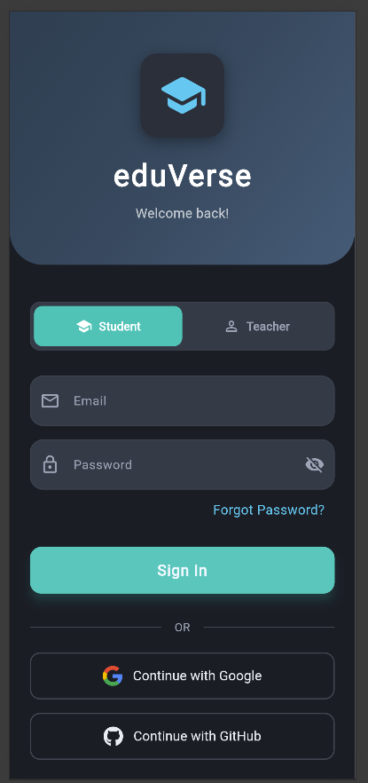
      <br><strong>Sign In Page</strong><br>
      <sub>Role-based authentication with OAuth support</sub>
    </td>
    <td align="center">
      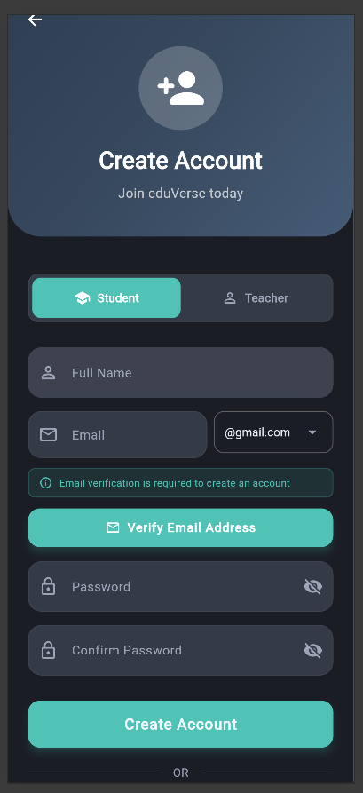
      <br><strong>Sign Up Page</strong><br>
      <sub>Email verification with professional workflow</sub>
    </td>
  </tr>
</table>

### 👨‍💼 Admin Dashboard
<table>
  <tr>
    <td align="center">
      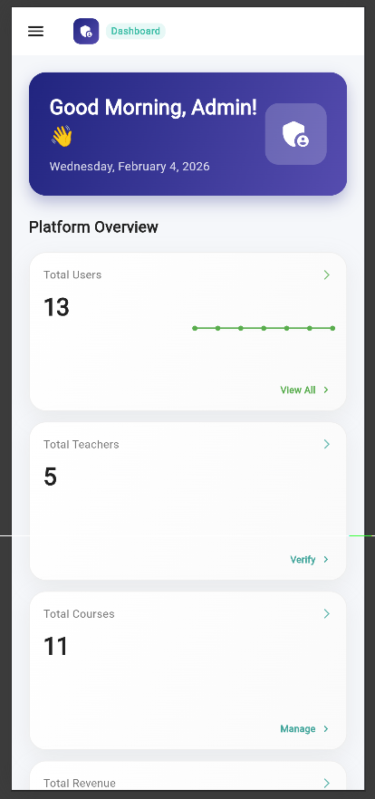
      <br><strong>Admin Dashboard</strong><br>
      <sub>Real-time KPIs and platform overview</sub>
    </td>
    <td align="center">
      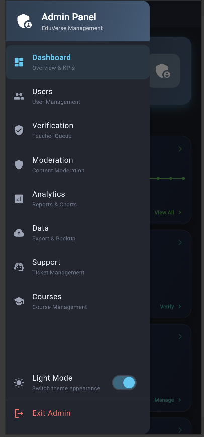
      <br><strong>Admin Navigation</strong><br>
      <sub>Comprehensive admin module access</sub>
    </td>
    <td align="center">
      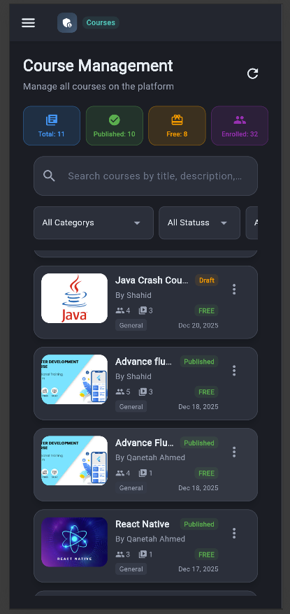
      <br><strong>Course Management</strong><br>
      <sub>Full course lifecycle administration</sub>
    </td>
  </tr>
</table>

### 🎓 Student Experience
<table>
  <tr>
    <td align="center">
      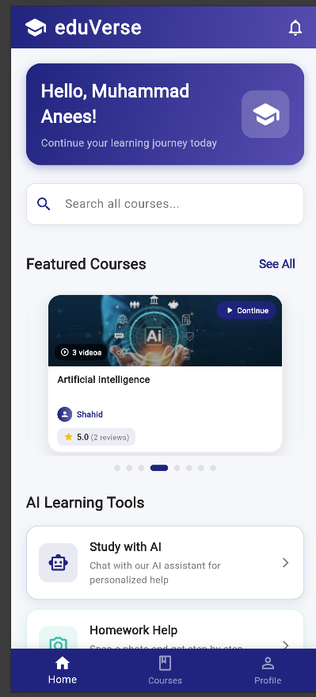
      <br><strong>Student Dashboard</strong><br>
      <sub>Personalized learning journey</sub>
    </td>
    <td align="center">
      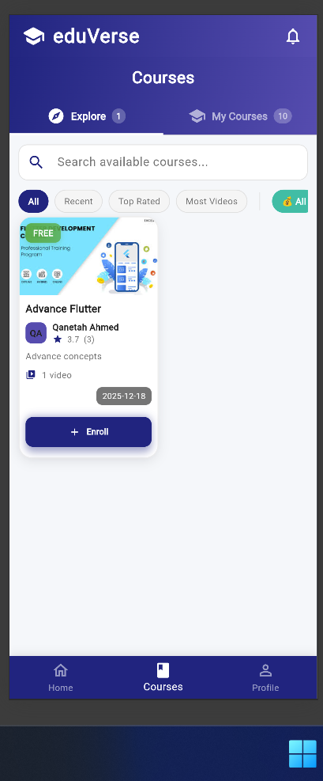
      <br><strong>Course Catalog</strong><br>
      <sub>Browse and enroll in courses</sub>
    </td>
  </tr>
  <tr>
    <td align="center">
      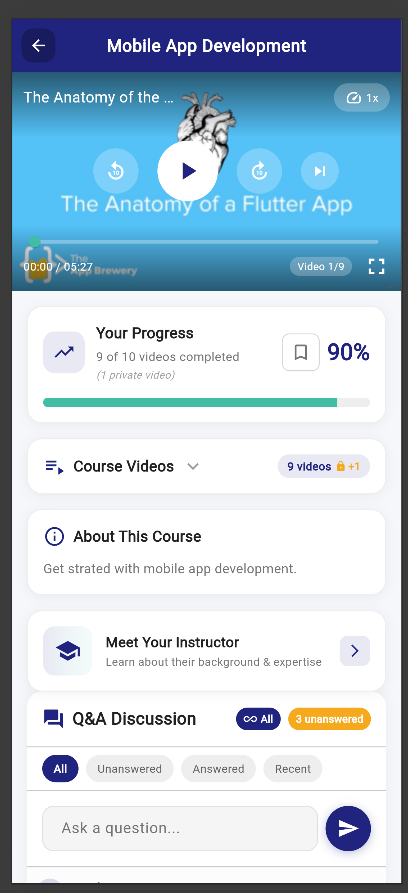
      <br><strong>Video Learning</strong><br>
      <sub>Custom video player with progress tracking</sub>
    </td>
    <td align="center">
      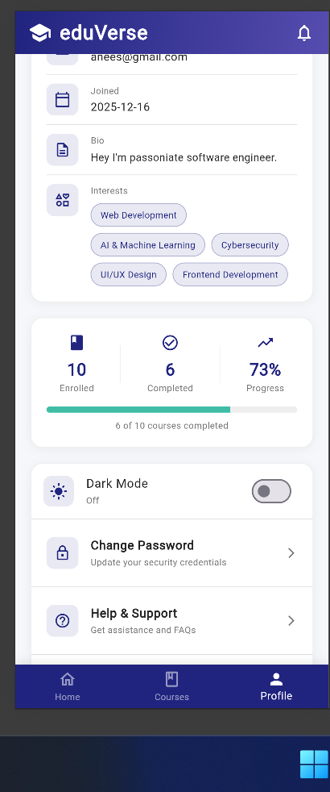
      <br><strong>Student Profile</strong><br>
      <sub>Progress tracking and achievements</sub>
    </td>
  </tr>
</table>

### 👨‍🏫 Teacher Portal
<table>
  <tr>
    <td align="center">
      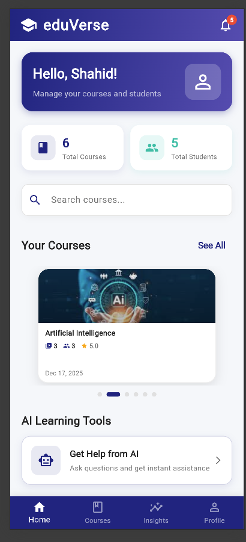
      <br><strong>Teacher Dashboard</strong><br>
      <sub>Course management and student tracking</sub>
    </td>
    <td align="center">
      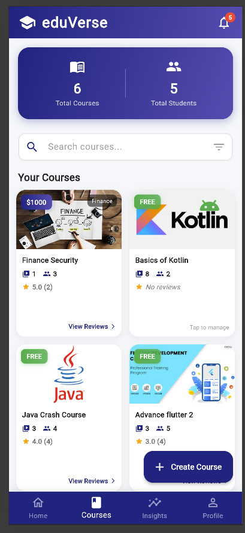
      <br><strong>Course Portfolio</strong><br>
      <sub>Manage your teaching portfolio</sub>
    </td>
  </tr>
  <tr>
    <td align="center">
      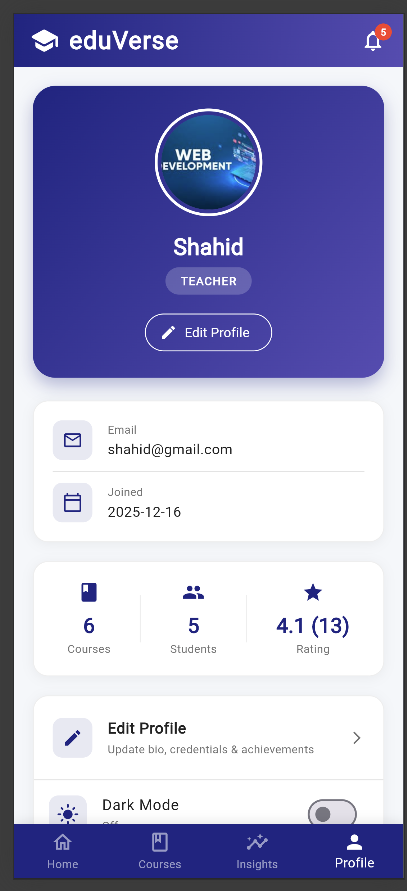
      <br><strong>Teacher Profile</strong><br>
      <sub>Professional credentials and ratings</sub>
    </td>
    <td align="center">
      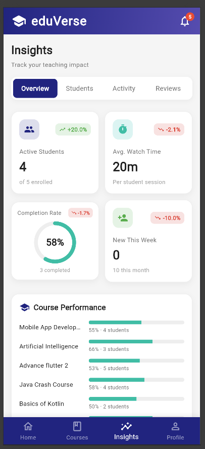
      <br><strong>Teaching Analytics</strong><br>
      <sub>Performance metrics and insights</sub>
    </td>
  </tr>
</table>

### 🎯 Course Creation
<table>
  <tr>
    <td align="center">
      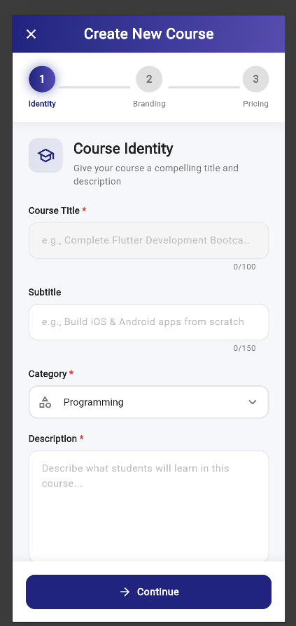
      <br><strong>Course Creation Wizard</strong><br>
      <sub>Professional course setup with guided steps</sub>
    </td>
  </tr>
</table>

---

## 🚀 Features

### 🔐 **Authentication & Security**
- **Multi-Role Authentication**: Students, Teachers, and Admins with role-based access control
- **OAuth Integration**: Google Sign-In for all users, GitHub for students
- **Email Verification**: 6-digit code verification with professional HTML emails
- **Secure Password Reset**: Multi-step verification process with rate limiting
- **Account Security**: Suspension/ban system with detailed tracking

### 👨‍🎓 **Student Features**
- **Personalized Dashboard**: Learning progress, course recommendations, and achievements
- **Course Discovery**: Advanced search, filtering, and categorization
- **Video Learning**: Custom video player with progress tracking and playback speed control
- **Interactive Q&A**: Course-specific discussion forums with voting system
- **Bookmarks System**: Save important lessons and resources for quick access
- **Progress Tracking**: Detailed analytics on learning journey and completion rates
- **AI Study Assistant**: Homework help, study guidance, and personalized recommendations
- **Mobile-First Design**: Optimized learning experience across all devices

### 👨‍🏫 **Teacher Features**
- **Professional Onboarding**: Multi-step wizard with credential verification
- **Course Creation Studio**: Comprehensive course builder with media upload
- **Student Management**: Track enrollments, progress, and engagement
- **Credential Portfolio**: Showcase certificates, degrees, and achievements
- **Teaching Analytics**: Detailed insights on course performance and student feedback
- **Revenue Dashboard**: Earnings tracking and payment management
- **Professional Profile**: Public profile with ratings, reviews, and expertise showcase
- **Content Moderation**: Review and manage student submissions and discussions

### 👨‍💼 **Admin Dashboard**
- **Real-time KPI Monitoring**: User growth, revenue, course metrics, and platform health
- **User Management**: Comprehensive user administration with suspend/verify actions
- **Teacher Verification Queue**: Review and approve teacher applications with document verification
- **Content Moderation**: AI-powered content filtering with manual review capabilities
- **Advanced Analytics**: User growth charts, revenue analytics, and engagement metrics
- **Data Export**: Export user data, course analytics, and platform reports
- **Support Ticket System**: Integrated help desk with priority management
- **Email Automation**: Professional email notifications for all administrative actions

### 🤖 **AI-Powered Features**
- **Smart Study Assistant**: Personalized homework help and study guidance
- **Content Recommendations**: AI-driven course and resource suggestions
- **Automated Content Moderation**: Real-time profanity and abuse detection
- **Learning Path Optimization**: AI-suggested learning sequences based on progress
- **Intelligent Search**: Enhanced course discovery with semantic search

### 🎨 **User Experience**
- **Responsive Design**: Perfect experience across desktop, tablet, and mobile
- **Dark/Light Mode**: System-wide theme toggle with user preferences
- **Offline Caching**: Course content available offline for uninterrupted learning
- **Progressive Loading**: Optimized performance with lazy loading and caching
- **Accessibility**: WCAG compliant with screen reader support
- **Internationalization**: Multi-language support with RTL text support

### 🔧 **Technical Excellence**
- **Real-time Updates**: Firebase real-time synchronization across all features
- **Scalable Architecture**: Provider-based state management with clean separation
- **Background Processing**: Async operations for file uploads and data processing
- **Push Notifications**: Course updates, assignments, and administrative alerts
- **Analytics Integration**: Detailed user behavior and learning analytics
- **Error Handling**: Comprehensive error tracking with user-friendly messages

---

## 🛠️ Tech Stack

### **Frontend**
-  **Flutter** - Cross-platform UI framework
-  **Dart** - Programming language
-  **Provider** - State management solution

### **Backend & Database**
-  **Firebase Authentication** - User authentication and authorization
-  **Firebase Realtime Database** - Real-time data synchronization
-  **Cloud Firestore** - Document database for complex queries
-  **Firebase Cloud Functions** - Serverless backend logic

### **Services & Integrations**
-  **Cloudinary** - Media management and optimization
-  **Node.js Email Server** - Administrative email notifications
-  **AI Integration** - Multiple AI providers for enhanced features

### **Development Tools**
-  **Git** - Version control
-  **VS Code** - Development environment
-  **Android Studio** - Android development

---

## 🏗️ Architecture

### **Project Structure**
```
lib/
├── features/               # Feature-based modules
│   ├── admin/             # Admin dashboard & management
│   └── teacher/           # Teacher-specific features
├── models/                # Data models and DTOs
├── services/              # Business logic and API services
├── utils/                 # Utilities and helpers
├── views/                 # UI screens and widgets
└── widgets/               # Reusable UI components
```

### **Key Services**
- **AuthService**: Authentication and user management
- **CourseService**: Course CRUD operations and enrollment
- **AdminService**: Administrative functions and analytics
- **AIService**: AI integration and intelligent features
- **CacheService**: Offline caching and performance optimization
- **ContentFilterService**: AI-powered content moderation

---

## ⚙️ Installation

### **Prerequisites**
- Flutter SDK (3.0+) - [Installation Guide](https://flutter.dev/docs/get-started/install)
- Dart SDK (3.0+)
- Android Studio / Xcode for mobile development
- Firebase CLI - [Setup Guide](https://firebase.google.com/docs/cli)

### **Setup Instructions**

1. **Clone the Repository**
   ```bash
   git clone <your-repo-url>
   cd EduVerse
   ```

2. **Install Dependencies**
   ```bash
   flutter pub get
   ```

3. **Firebase Configuration**
   ```bash
   # Install Firebase CLI
   npm install -g firebase-tools
   
   # Login to Firebase
   firebase login
   
   # Configure project (ensure firebase_options.dart is generated)
   flutterfire configure
   ```

4. **Environment Setup**
   - Create `.env` file in project root:
   ```env
   GEMINI_API_KEY=your_gemini_api_key
   OPENROUTER_API_KEY=your_openrouter_api_key
   ```

5. **Email Server Setup (Optional)**
   ```bash
   cd email-server
   npm install
   npm start
   ```

6. **Run the Application**
   ```bash
   # Development
   flutter run

   # Release builds
   flutter build apk --release        # Android
   flutter build ios --release        # iOS
   flutter build web --release        # Web
   ```

### **Admin Account Setup**
```bash
cd scripts
node setup_admin.js
```

---

## 🧪 Testing

### **Run Tests**
```bash
# Unit tests
flutter test

# Integration tests
flutter test integration_test/

# Widget tests
flutter test test/widget/
```

### **Code Quality**
```bash
# Static analysis
flutter analyze

# Code formatting
dart format .
```

---

## 📊 Project Statistics

- **Total Files**: 200+ Dart files
- **Lines of Code**: 50,000+ lines
- **Features**: 100+ implemented features
- **Supported Platforms**: Android, iOS, Web, Desktop
- **Database Rules**: Comprehensive security rules for Firebase
- **AI Integrations**: Multiple AI service providers
- **Admin Tools**: 8 comprehensive admin modules

---

## 🤝 Contributing

We welcome contributions! Please follow these guidelines:

1. **Fork the Repository**
2. **Create a Feature Branch**
   ```bash
   git checkout -b feature/amazing-feature
   ```
3. **Commit Your Changes**
   ```bash
   git commit -m 'Add amazing feature'
   ```
4. **Push to Branch**
   ```bash
   git push origin feature/amazing-feature
   ```
5. **Open a Pull Request**

### **Development Guidelines**
- Follow Flutter/Dart style guidelines
- Add tests for new features
- Update documentation as needed
- Ensure responsive design compliance

---

## 📋 Roadmap

### **Upcoming Features**
- [ ] Advanced video analytics
- [ ] Real-time collaborative learning
- [ ] Mobile app notifications
- [ ] Advanced reporting system
- [ ] Multi-language support
- [ ] Integration with external LMS platforms

### **Long-term Goals**
- [ ] Machine learning-powered personalization
- [ ] Virtual classroom integration
- [ ] Advanced assessment tools
- [ ] Blockchain-based certificates

---

## 📞 Contact & Support

<div align="center">

**Project Maintainer**: Muhammad Anees  
**Email**: sp23-bse-030@isbstudent.comsats.ed.pk  
**University**: COMSATS University Islamabad  

[](https://github.com/your-repo/issues)
[](mailto:sp23-bse-030@isbstudent.comsats.ed.pk)

</div>

---

## 📄 License

This project is currently **not licensed**. Please contact the repository owner for usage permissions and licensing information.

---

<div align="center">

**⭐ If you found this project helpful, please consider giving it a star!**

*Built with ❤️ using Flutter and Firebase*

</div>