# 🎓 EduVerse — Complete Educational Learning Platform

<div align="center">


*EduVerse is an enterprise-style, cross-platform Learning Management System built with Flutter and Firebase. It provides role-based experiences for Students, Teachers, and Admins, combining modern course delivery, AI-assisted learning, real-time academic tracking, and operational control in a single platform. From content creation and assessments to moderation, analytics, and support workflows, EduVerse is designed to run end-to-end education operations with performance, scalability, and security.*

[Features](#-features) · [Screenshots](#-screenshots) · [Tech Stack](#-tech-stack) · [Architecture](#-architecture) · [Installation](#%EF%B8%8F-installation) · [Services](#-services-reference) · [Contributing](#-contributing)

---

</div>

## 🚀 Features

### 🔐 Authentication & Security
| Feature | Description |
|---------|-------------|
| **Multi-Role Auth** | Three distinct roles — Student, Teacher, Admin — each with dedicated dashboards and permissions |
| **Google OAuth** | One-tap Google Sign-In for all roles via `google_sign_in` |
| **Email Verification** | 6-digit code verification with professional HTML email templates sent via Node.js email server |
| **Secure Password Reset** | Multi-step flow with rate limiting and verification codes |
| **Account Suspension** | Admin can suspend/unsuspend users with reason tracking; suspended users see a block notice |
| **Firebase Security Rules** | Granular read/write rules in `database.rules.json` covering every database node |

---

### 👨‍🎓 Student Features

#### Core Learning
| Feature | Description |
|---------|-------------|
| **Personalized Home** | Welcome card, enrolled courses carousel with page indicators, AI quick actions, and announcements |
| **Course Discovery** | Full catalog with search, category filters, and enrollment with payment integration |
| **Course Detail View** | Course info, video list, reviews, Q&A section, bookmark toggle, and teacher profile |
| **Advanced Video Player** | Custom player with playback speed control (0.5x–2x), fullscreen, progress persistence, and resume-from-last-position |
| **Interactive Q&A** | Per-course discussion forum with voting, replies, and real-time updates |
| **Bookmarks** | Save/unsave courses for quick access from profile |
| **Certificates** | Auto-generated completion certificates viewable in a dedicated screen |

#### Assignments & Quizzes
| Feature | Description |
|---------|-------------|
| **Assignments** | Browse assignments per course, submit work, and view grades |
| **Quizzes** | Timed quiz taking with multiple question types, instant score reveal, and result history |

#### AI-Powered Tools
| Feature | Description |
|---------|-------------|
| **AI Chat Assistant** | Full conversational study assistant powered by Gemini & OpenRouter APIs with chat history persistence |
| **AI Camera** | Point camera at homework/textbook; AI analyzes the image and provides explanations |
| **Course Recommendations** | `CourseRecommendationService` suggests courses based on enrollment history, category affinity, and rating |

#### Progress & Gamification
| Feature | Description |
|---------|-------------|
| **Study Streak Tracking** | `StudyStreakService` tracks daily activity; streak card on home tab shows current/longest streak with fire animation |
| **Learning Stats Dashboard** | Full-screen dashboard with weekly activity bar chart, 6-stat grid (hours, sessions, videos, quizzes, assignments), and activity breakdown progress bars |
| **Course Notes** | `CourseNotesService` + `CourseNotesSheet` for per-course note-taking with timestamps |
| **Progress Tracking** | Video completion percentage, quiz scores, assignment status — all aggregated per course |

#### Profile & Settings
| Feature | Description |
|---------|-------------|
| **Editable Profile** | Update display name, avatar, bio |
| **Dark / Light Mode** | System-wide theme toggle persisted via `ThemeService` + `SharedPreferences` |
| **Notifications** | Real-time notification feed from announcements, course updates, and admin messages |

---

### 👨‍🏫 Teacher Features

#### Onboarding & Profile
| Feature | Description |
|---------|-------------|
| **Multi-Step Onboarding Wizard** | 3-step guided setup: Bio → Credentials (with image upload to Cloudinary) → Profile Picture |
| **Professional Profile** | Public-facing profile widget with ratings, reviews, course count, and credential showcase |
| **Credential Management** | Upload and display certificates, degrees, and professional documents |

#### Course Creation & Management
| Feature | Description |
|---------|-------------|
| **Course Creation Wizard** | Step-by-step course builder: title, description, category, thumbnail, pricing, and content outline |
| **Video Upload** | Background upload to Cloudinary with progress indicator and thumbnail generation |
| **Quiz Builder** | Create MCQ quizzes with correct answers, point values, time limits |
| **Assignment Builder** | Create assignments with descriptions, due dates, and grading |
| **Course Management** | Edit, publish/unpublish, reorder videos, manage Q&A, and view enrollments |
| **Course Duplication** | Clone an entire course (structure, videos, quizzes) into a new draft via `TeacherFeatureService.duplicateCourse()` |

#### Analytics & Insights
| Feature | Description |
|---------|-------------|
| **Teaching Analytics** | Multi-tab analytics dashboard (3,100+ lines) — overview, students, courses, engagement |
| **Course Engagement** | Per-course metrics: enrolled count, avg rating, videos, Q&A, reviews |
| **Student Progress Reports** | Per-student drill-down: video completion %, quiz scores, assignment status |
| **Revenue Dashboard** | Total earnings with growth %, monthly trend bar chart, per-course revenue breakdown |

#### Communication
| Feature | Description |
|---------|-------------|
| **Course Announcements** | Compose announcements (General/Update/Assignment types), auto-send notifications to all enrolled students |
| **Home Tab Announcements** | Teachers see and create announcements directly from home tab |

#### Home Tab Tools
| Feature | Description |
|---------|-------------|
| **Quick Stats** | Clickable stat cards (courses, students, revenue) on teacher home |
| **AI Assistant** | Same AI chat available to teachers for content creation help |
| **Teaching Tools** | Quick-access cards for Course Engagement and Revenue Dashboard |

---

### 👨‍💼 Admin Dashboard

The admin panel features a **responsive sidebar/drawer navigation** (desktop expanded sidebar, tablet navigation rail, mobile hamburger drawer) via `AdminScaffold` with **13 modules**:

#### Core Administration
| # | Module | Description |
|---|--------|-------------|
| 0 | **Dashboard** | Real-time KPI cards (users, teachers, courses, revenue), quick action buttons, live activity stream via `StreamBuilder` |
| 1 | **Users** | Paginated user list, search, role filter, suspend/unsuspend with reason, view profiles |
| 2 | **Verification** | Teacher application queue — review credentials, approve/reject with email notification |
| 3 | **Moderation** | Reported content queue (Pending/Resolved tabs), full detail view with keep/warn/suspend/delete actions, priority badges |
| 4 | **Analytics** | User growth charts, revenue analytics, engagement metrics with date filters |
| 5 | **Data** | Export users, courses, analytics as CSV/reports |
| 6 | **Support** | Ticket management with priority, status tracking, and response system |
| 7 | **Courses** | Browse all platform courses, view details, delete courses |

#### Extended Admin Features
| # | Module | Description |
|---|--------|-------------|
| 8 | **Announcements** | Broadcast platform-wide announcements with priority levels (Normal/Important/Urgent), target audience (All/Students/Teachers), activate/deactivate/delete |
| 9 | **Audit Log** | Chronological timeline of all admin actions with icon-coded entries, action type filters, admin UID tracking |
| 10 | **Settings** | Maintenance mode toggle, registration on/off, email verification requirement, max upload size slider, max courses per teacher, platform name & support email |
| 11 | **Bulk Actions** | Multi-select users with search & role filter, batch suspend/unsuspend with reason, select all/clear all |
| 12 | **Content Insights** | 6-stat grid (courses, published, drafts, videos, quizzes, avg rating), publication status bar, category breakdown with progress bars, top courses by enrollment |

#### Admin Infrastructure
- **AdminProvider** (`ChangeNotifierProvider`) — centralized state: KPI stats, paginated users, reported content, growth/revenue data, with optimistic UI updates
- **AdminService** (1,050+ lines) — Firebase operations: CRUD, analytics aggregation, email automation, data export
- **AdminFeatureService** — backend for announcements, audit log, settings, bulk actions, content insights
- **ModernKPICard** widget — animated stat cards with icon, value, label, and tap-to-navigate

---

### 🤖 AI Integration
| Service | Provider | Purpose |
|---------|----------|---------|
| `GeminiApiService` | Google Gemini | Primary AI for chat, homework help, image analysis |
| `OpenRouterAiService` | OpenRouter | Fallback/alternative AI provider |
| `AIChatScreen` | — | Full chat UI with history persistence via `ChatHistoryService` + `ChatRepository` |
| `AICameraScreen` | — | Camera capture → AI analysis for homework problems |
| `ContentFilterService` | — | Real-time profanity and abuse detection for user-generated content |
| `CourseRecommendationService` | — | Algorithmic course suggestions based on user behavior |

---

### 🎨 UI/UX Design System
| Feature | Implementation |
|---------|---------------|
| **Dark Mode** | Full dark theme via `AppTheme` utility — `isDarkMode()`, `getCardColor()`, `getTextPrimary()`, `getBackgroundColor()`, etc. |
| **Animated Background** | `AnimatedDarkBackground` widget: mesh gradients, floating particles, subtle grid, and glow effects |
| **Route Transitions** | `SlideAndFadeRoute` custom page transitions |
| **Loading States** | `EngagingLoadingIndicator` with animated shimmer, `QuickLoadingWidget` for inline loading |
| **Responsive Layout** | Adaptive layouts: mobile (<768px), tablet (768–1199px), desktop (≥1200px) |
| **Cached Images** | `CachedNetworkImage` throughout for network image caching with placeholder/error widgets |
| **Video Thumbnails** | `VideoThumbnailWidget` with Cloudinary URL optimization |
| **Upload Progress** | `UploadProgressWidget` for visual file upload tracking |

---

## 📸 Screenshots

To keep the README clean and easy to scan, screenshots are split into a quick preview and an expandable full gallery.

### Authentication
<p align="center">
        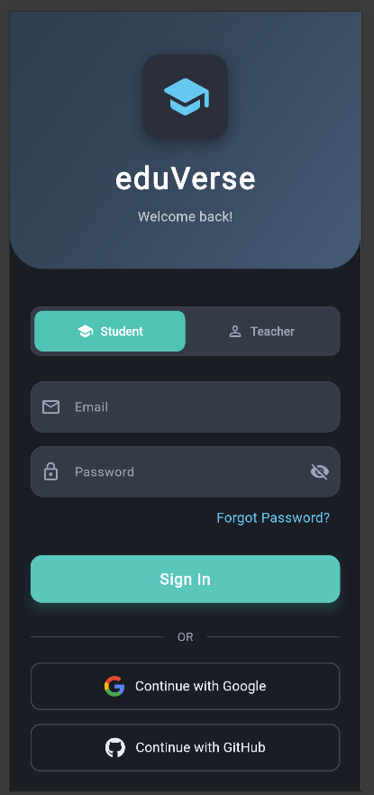
        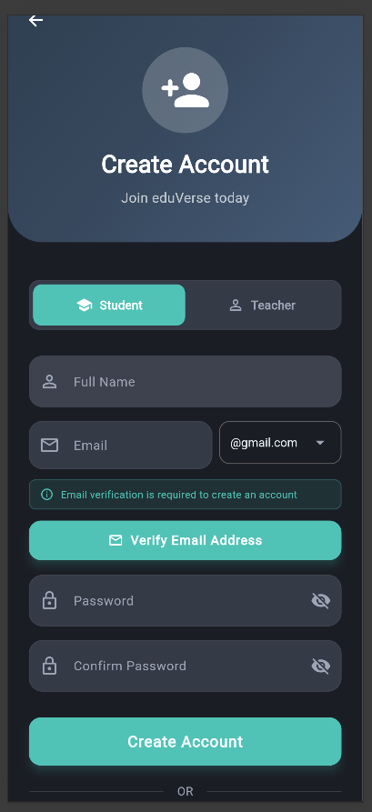
</p>

### Student Quick Preview
<p align="center">
        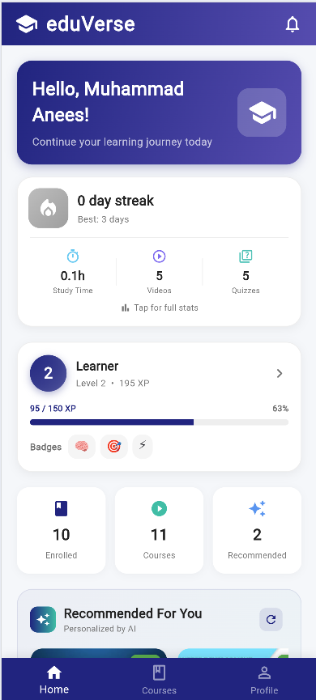
        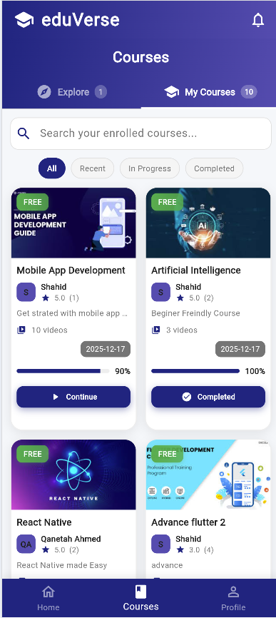
        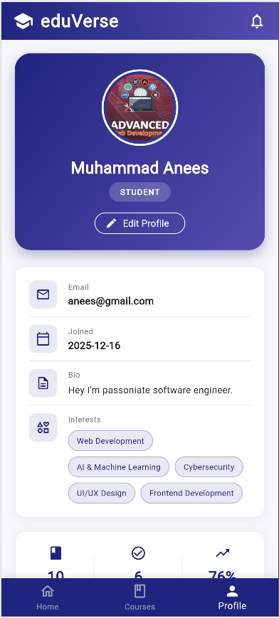
</p>

<details>
<summary><strong>View Full Student Gallery (8 Screens)</strong></summary>

<br />

| Courses | Course Detail |
|---------|---------------|
|  | 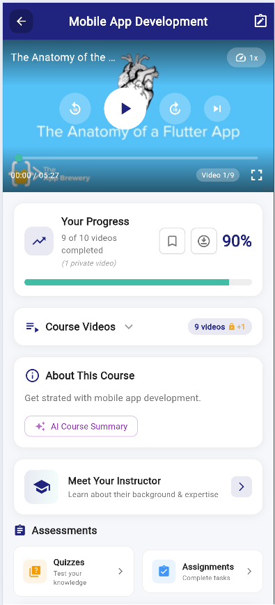 |

| Discussion | Home |
|------------|------|
| 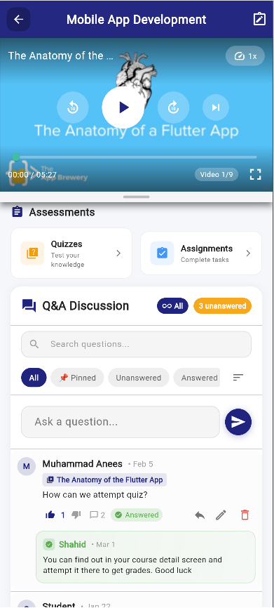 |  |

| Quizzes | Assignments |
|---------|-------------|
| 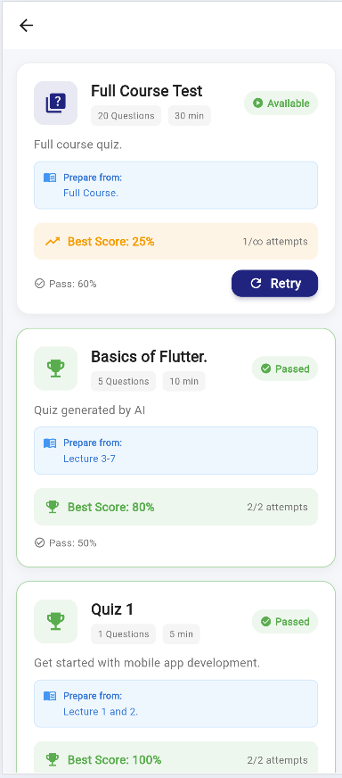 | 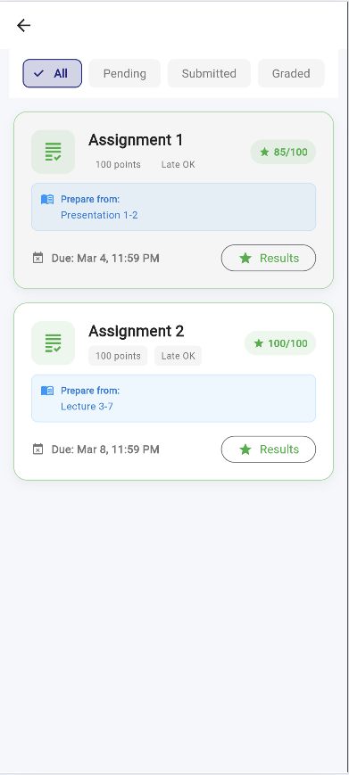 |

| Profile | Settings |
|---------|----------|
|  | 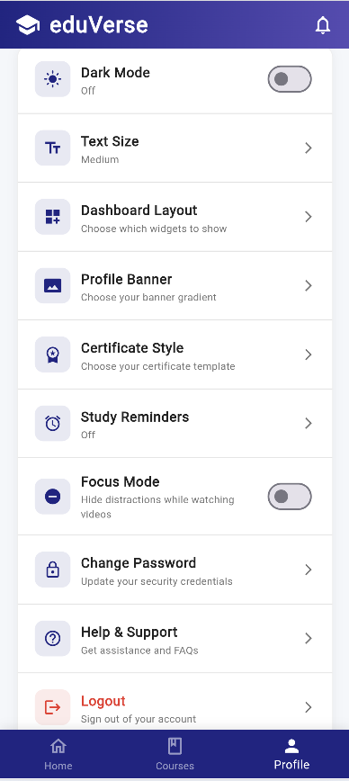 |

</details>

### Admin Quick Preview
<p align="center">
        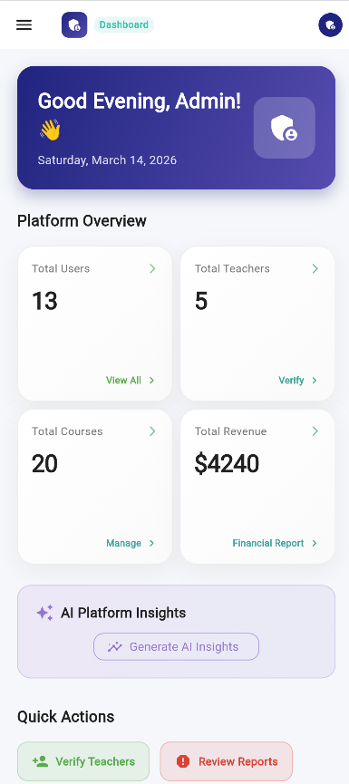
        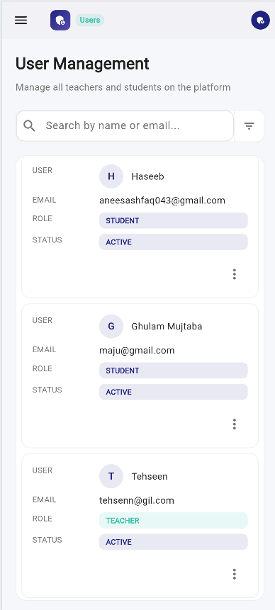
        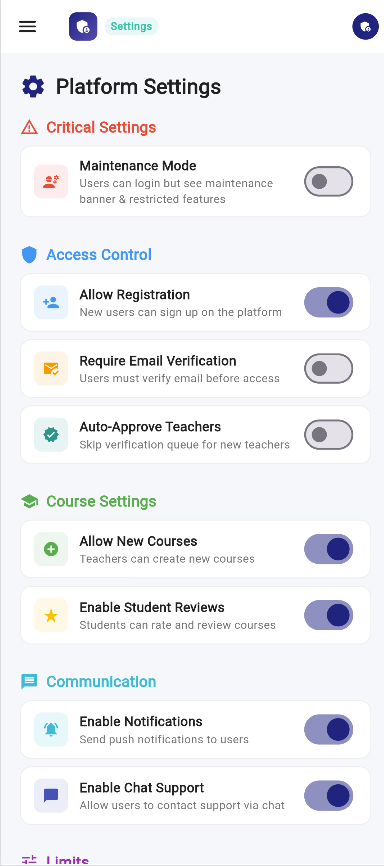
</p>

<details>
<summary><strong>View Full Admin Gallery (10 Screens)</strong></summary>

<br />

| Dashboard | Navigation Drawer |
|----------|--------------------|
|  | 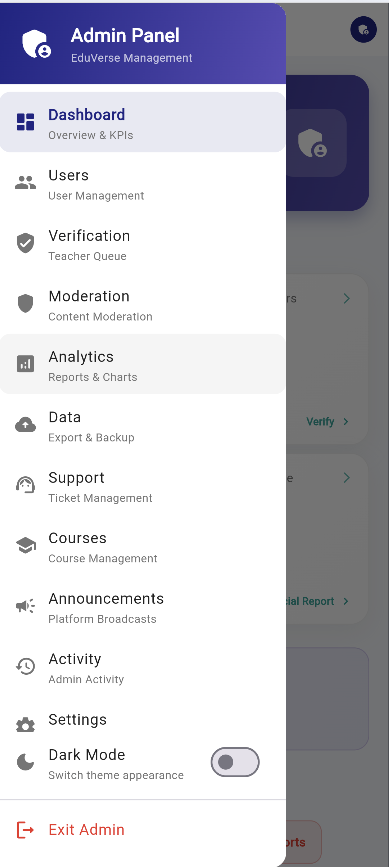 |

| User Management | Content Moderation |
|-----------------|--------------------|
|  | 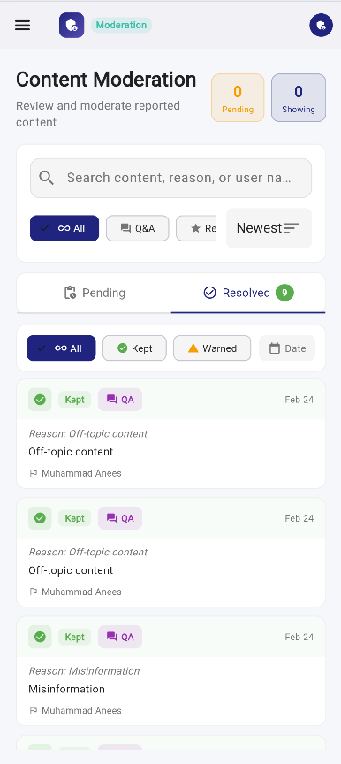 |

| Analytics | Support Center |
|----------|-----------------|
| 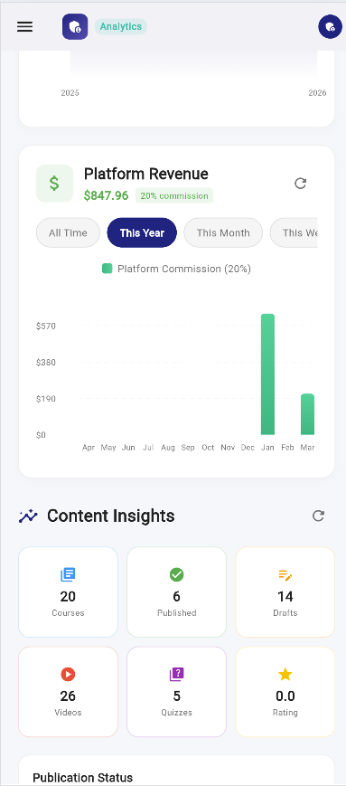 | 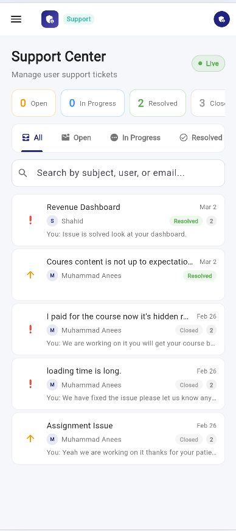 |

| Course Management | Course Detail |
|-------------------|---------------|
| 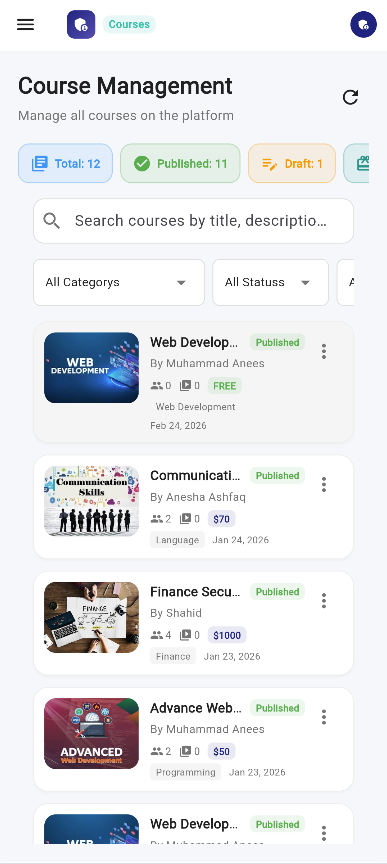 | 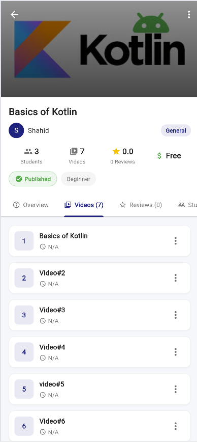 |

| Activity Log | Platform Settings |
|--------------|-------------------|
| 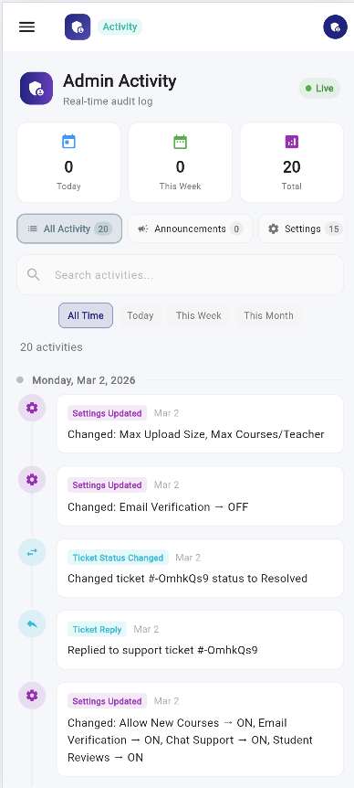 |  |

</details>

---

## �🛠️ Tech Stack

### Frontend
| Technology | Purpose |
|-----------|---------|
| **Flutter 3.10+** | Cross-platform UI framework (Android, iOS, Web, Windows, macOS, Linux) |
| **Dart 3.10+** | Programming language |
| **Provider** | State management (`AdminProvider`, `ThemeService`) |

### Backend & Database
| Technology | Purpose |
|-----------|---------|
| **Firebase Auth** | Authentication with email/password + Google OAuth |
| **Firebase Realtime Database** | Primary data store — real-time sync for all entities |
| **Firebase Cloud Functions** | Serverless email sending via `utils/sendEmail.js` |
| **Firebase Security Rules** | Node-level read/write permissions |

### Media & Storage
| Technology | Purpose |
|-----------|---------|
| **Cloudinary** | Video & image hosting via `uploadToCloudinary.dart` — supports `XFile` uploads with 30s timeout |
| **Image Picker** | Camera and gallery selection for profile pics, credentials, course thumbnails |
| **Video Player** | `video_player` package wrapped in `AdvancedVideoPlayer` widget |

### External Services
| Technology | Purpose |
|-----------|---------|
| **Node.js Email Server** | Sends verification codes, admin notifications |
| **Google Gemini API** | AI chat and image analysis |
| **OpenRouter API** | Alternative AI provider |

### Key Dependencies
```yaml
firebase_core: ^4.2.1
firebase_database: ^12.1.0
firebase_auth: ^6.1.2
provider: ^6.1.2
google_sign_in: ^6.2.2
cached_network_image: ^3.3.1
video_player: ^2.6.0
image_picker: ^1.2.1
fl_chart: ^1.1.1
flutter_markdown: ^0.6.18+2
intl: ^0.18.1
shared_preferences: ^2.3.3
http: ^1.2.0
crypto: ^3.0.6
flutter_dotenv: ^6.0.0
path_provider: ^2.1.2
file_picker: ^8.0.0+1
font_awesome_flutter: ^10.7.0
flutter_svg: ^2.0.10+1
video_thumbnail: ^0.5.3
mailer: ^6.1.2
```

---

## 🏗️ Architecture

### Project Structure
```
lib/
├── main.dart                        # App entry, Firebase init, Provider setup
├── firebase_options.dart            # Firebase config (auto-generated)
│
├── features/
│   └── admin/
│       ├── providers/
│       │   └── admin_provider.dart          # Centralized admin state
│       ├── services/
│       │   ├── admin_service.dart           # 1,050+ lines — Firebase admin ops
│       │   └── admin_feature_service.dart   # Announcements, audit, settings, bulk, insights
│       ├── screens/                         # 14 admin screens
│       │   ├── admin_dashboard_screen.dart
│       │   ├── admin_users_screen.dart
│       │   ├── admin_verification_queue_screen.dart
│       │   ├── admin_moderation_screen.dart
│       │   ├── admin_analytics_screen.dart
│       │   ├── admin_data_screen.dart
│       │   ├── admin_support_screen.dart
│       │   ├── admin_all_courses_screen.dart
│       │   ├── admin_course_detail_screen.dart
│       │   ├── admin_announcements_screen.dart
│       │   ├── admin_audit_log_screen.dart
│       │   ├── admin_platform_settings_screen.dart
│       │   ├── admin_bulk_actions_screen.dart
│       │   └── admin_content_insights_screen.dart
│       └── widgets/
│           ├── admin_scaffold.dart          # Responsive sidebar/rail/drawer
│           └── modern_kpi_card.dart         # Animated KPI card
│
├── models/
│   ├── course_model.dart
│   └── user_model.dart
│
├── services/                        # 33 service files
│   ├── auth_service.dart
│   ├── course_service.dart
│   ├── user_service.dart
│   ├── ai_service.dart
│   ├── gemini_api_service.dart
│   ├── openrouter_ai_service.dart
│   ├── cache_service.dart
│   ├── data_preloader_service.dart
│   ├── analytics_service.dart
│   ├── assignment_service.dart
│   ├── quiz_service.dart
│   ├── qa_service.dart
│   ├── bookmark_service.dart
│   ├── certificate_service.dart
│   ├── chat_history_service.dart
│   ├── chat_repository.dart
│   ├── content_filter_service.dart
│   ├── course_notes_service.dart
│   ├── course_recommendation_service.dart
│   ├── email_verification_service.dart
│   ├── learning_stats_service.dart
│   ├── moderation_service.dart
│   ├── notification_service.dart
│   ├── payment_service.dart
│   ├── preferences_service.dart
│   ├── study_streak_service.dart
│   ├── support_service.dart
│   ├── teacher_feature_service.dart
│   ├── theme_service.dart
│   ├── thumbnail_service.dart
│   ├── background_upload_service.dart
│   ├── uploadToCloudinary.dart
│   └── video_player_widget.dart
│
├── utils/
│   ├── app_theme.dart              # Theme colors, dark mode helpers
│   ├── route_transitions.dart      # SlideAndFadeRoute
│   └── analytics_mock_data.dart
│
├── views/
│   ├── eduverse_app.dart           # MaterialApp config
│   ├── splash_screen.dart          # Splash with role routing
│   ├── signin_screen.dart
│   ├── register_screen.dart
│   ├── register_screen_with_verification.dart
│   ├── notifications_screen.dart
│   │
│   ├── student/                    # 14 student screens
│   │   ├── home_screen.dart
│   │   ├── home_tab.dart
│   │   ├── courses_screen.dart
│   │   ├── student_course_detail_screen.dart
│   │   ├── ai_chat_screen.dart
│   │   ├── ai_camera_screen.dart
│   │   ├── certificate_screen.dart
│   │   ├── profile_screen.dart
│   │   ├── student_edit_profile_screen.dart
│   │   ├── student_quiz_list_screen.dart
│   │   ├── student_quiz_screen.dart
│   │   ├── student_assignment_list_screen.dart
│   │   ├── student_assignment_screen.dart
│   │   └── learning_stats_screen.dart
│   │
│   └── teacher/                    # 17 teacher screens
│       ├── teacher_home_screen.dart
│       ├── teacher_home_tab.dart
│       ├── teacher_courses_screen.dart
│       ├── teacher_course_manage_screen.dart
│       ├── create_course_wizard.dart
│       ├── add_course_screen.dart
│       ├── course_detail_screen.dart
│       ├── teacher_analytics_screen.dart
│       ├── teacher_students_screen.dart
│       ├── teacher_profile_screen.dart
│       ├── teacher_onboarding_wizard.dart
│       ├── teacher_quiz_manage_screen.dart
│       ├── teacher_assignment_manage_screen.dart
│       ├── teacher_announcements_screen.dart
│       ├── teacher_revenue_dashboard.dart
│       ├── teacher_course_engagement_screen.dart
│       └── student_progress_report_screen.dart
│
└── widgets/                        # 12 reusable widgets
    ├── advanced_video_player.dart
    ├── animated_dark_background.dart
    ├── course_card.dart
    ├── course_notes_sheet.dart
    ├── engaging_loading_indicator.dart
    ├── qa_section_widget.dart
    ├── quick_loading_widget.dart
    ├── study_streak_card.dart
    ├── teacher_public_profile_widget.dart
    ├── upload_progress_widget.dart
    ├── video_thumbnail_widget.dart
    └── analytics/
```

### State Management
- **Provider** — global providers registered in `main.dart`:
  - `AdminProvider` — admin KPIs, user list, reported content, analytics data
  - `ThemeService` — dark/light mode toggle
- **StatefulWidget** — local state for individual screens with `setState()`
- **Static caches** — cross-rebuild data persistence in analytics and home screens

### Data Flow
```
User Action → Screen Widget → Service Layer → Firebase RTDB
                                    ↓
                            Cache Service (optional)
                                    ↓
                            setState() / Provider.notifyListeners()
                                    ↓
                              UI Rebuild
```

### Firebase Database Structure
```
├── student/{uid}/          # Student profiles, enrollments, progress
├── teacher/{uid}/          # Teacher profiles, courses, credentials
├── admin/{uid}/            # Admin profiles
├── courses/{courseId}/     # Course data, videos, quizzes, reviews
├── payments/{id}/          # Payment transactions
├── notifications/{uid}/    # Per-user notifications
├── support_tickets/{id}/   # Support ticket data
├── reported_content/{id}/  # Moderation queue
├── quiz_results/{uid}/     # Quiz attempt results
├── assignment_submissions/ # Student assignment submissions
├── courseProgress/{uid}/   # Video completion tracking
├── course_announcements/   # Teacher course announcements
├── platform_announcements/ # Admin platform-wide announcements
├── admin_audit_log/        # Admin action audit trail
├── platform_settings/      # Platform config (maintenance, limits)
├── registered_emails/      # Email uniqueness enforcement
└── chat_history/{uid}/     # AI chat conversation history
```

---

## ⚙️ Installation

### Prerequisites
- **Flutter SDK** 3.10+ — [Install Flutter](https://flutter.dev/docs/get-started/install)
- **Dart SDK** 3.10+ (bundled with Flutter)
- **Node.js** 18+ (for email server and Cloud Functions)
- **Firebase CLI** — `npm install -g firebase-tools`
- **Android Studio** / **Xcode** for mobile builds

### Setup

#### 1. Clone & Install
```bash
git clone https://github.com/Anees040/EduVerse.git
cd EduVerse
flutter pub get
```

#### 2. Firebase Configuration
```bash
firebase login
flutterfire configure       # Generates firebase_options.dart
firebase deploy --only database  # Deploy security rules
```

#### 3. Environment Variables
Create a `.env` file in the project root:
```env
GEMINI_API_KEY=your_gemini_api_key_here
OPENROUTER_API_KEY=your_openrouter_api_key_here
```

#### 4. Email Server (Optional)
```bash
cd email-server
npm install
# Add your serviceAccountKey.json
node server.js
```

#### 5. Cloud Functions (Optional)
```bash
cd functions
npm install
firebase deploy --only functions
```

#### 6. Admin Account Setup
```bash
cd scripts
npm install
node setup_admin.js
```

#### 7. Run the App
```bash
# Debug
flutter run

# Specific platform
flutter run -d chrome
flutter run -d windows
flutter run -d android

# Release builds
flutter build apk --release
flutter build web --release
flutter build windows --release
```

---

## 📊 Services Reference

| # | Service | Responsibility |
|---|---------|----------------|
| 1 | `auth_service` | Sign in/up, password reset, role routing |
| 2 | `course_service` | Course CRUD, enrollment, search |
| 3 | `user_service` | Profile read/update, avatar |
| 4 | `ai_service` | AI abstraction — routes to Gemini or OpenRouter |
| 5 | `gemini_api_service` | Google Gemini API calls |
| 6 | `openrouter_ai_service` | OpenRouter API calls |
| 7 | `cache_service` | In-memory + SharedPreferences caching |
| 8 | `data_preloader_service` | Preload critical data on app start |
| 9 | `analytics_service` | Learning analytics aggregation |
| 10 | `assignment_service` | Assignment CRUD, submissions, grading |
| 11 | `quiz_service` | Quiz CRUD, attempt tracking, results |
| 12 | `qa_service` | Discussion forum CRUD, voting, replies |
| 13 | `bookmark_service` | Course bookmark toggle |
| 14 | `certificate_service` | Certificate generation on completion |
| 15 | `chat_history_service` | AI chat conversation persistence |
| 16 | `chat_repository` | Chat data layer |
| 17 | `content_filter_service` | Profanity detection for UGC |
| 18 | `course_notes_service` | Per-course note-taking |
| 19 | `course_recommendation_service` | Algorithmic course suggestions |
| 20 | `email_verification_service` | 6-digit verification code flow |
| 21 | `learning_stats_service` | Weekly/daily activity metrics |
| 22 | `moderation_service` | Content reporting and flagging |
| 23 | `notification_service` | In-app notification management |
| 24 | `payment_service` | Payment processing & records |
| 25 | `preferences_service` | User preference persistence |
| 26 | `study_streak_service` | Daily streak tracking & calculation |
| 27 | `support_service` | Support ticket CRUD |
| 28 | `teacher_feature_service` | Announcements, revenue, duplication, progress, engagement |
| 29 | `theme_service` | Dark/light mode toggle & persistence |
| 30 | `thumbnail_service` | Video thumbnail generation |
| 31 | `background_upload_service` | Async file upload management |
| 32 | `uploadToCloudinary` | Cloudinary upload with XFile support & timeout |
| 33 | `admin_service` | Admin Firebase operations (1,050+ lines) |
| 34 | `admin_feature_service` | Announcements, audit log, settings, bulk actions, insights |

---

## 🧪 Testing & Quality

```bash
# Run all tests
flutter test

# Static analysis (0 issues)
flutter analyze

# Format code
dart format .
```

### Code Quality Standards
- **Zero lint errors** enforced via `analysis_options.yaml`
- All async operations use proper `mounted` checks
- Cloudinary uploads have 30-second timeouts
- Firebase queries use `limitToLast()` for pagination
- Optimistic UI updates in admin provider actions

---

## 📋 Database Security

Firebase security rules are defined in `database.rules.json`:
- **Role-based access**: Students read/write their own data; teachers manage their courses; admins have full access
- **Email uniqueness**: `registered_emails` node prevents duplicate registrations
- **Content protection**: Course data readable by enrolled students only
- **Admin verification**: Admin actions validated against `admin/{uid}` node

```bash
firebase deploy --only database
```

---

## 📂 Scripts

| Script | Purpose |
|--------|---------|
| `scripts/setup_admin.js` | Create initial admin account in Firebase |
| `scripts/populate_registered_emails.js` | Migrate existing users to `registered_emails` node |
| `scripts/migrate_chat_history.js` | Migrate AI chat data to new schema |

---

## 🗺️ Roadmap

- [x] Multi-role authentication (Student, Teacher, Admin)
- [x] Course creation, enrollment, and video learning
- [x] AI-powered study assistant with chat history
- [x] Teacher analytics and revenue dashboard
- [x] Admin content moderation with full detail view
- [x] Platform announcements and audit log
- [x] Study streak tracking and learning stats
- [x] Course recommendations engine
- [x] Bulk user management
- [x] Platform settings (maintenance mode, limits)
- [x] Content insights dashboard
- [x] Course duplication for teachers
- [x] Student progress reports
- [ ] Real-time collaborative study rooms
- [ ] Push notifications via FCM
- [ ] Advanced assessment rubrics
- [ ] Multi-language / RTL support
- [ ] Blockchain-based certificates

---

## 🤝 Contributing

1. **Fork** the repository
2. **Create** a feature branch: `git checkout -b feature/your-feature`
3. **Commit** changes: `git commit -m "feat: add your feature"`
4. **Push**: `git push origin feature/your-feature`
5. **Open** a Pull Request

### Guidelines
- Follow Dart/Flutter style conventions
- Run `flutter analyze` before submitting (0 issues required)
- Use `AppTheme` utilities for all colors/themes
- Support both dark and light mode in new screens
- Add `mounted` checks after every `await` in `StatefulWidget`

---

## 👤 Author

**Muhammad Anees**
- **University**: COMSATS University Islamabad
- **Roll Number**: SP23-BSE-030
- **Email**: sp23-bse-030@isbstudent.comsats.ed.pk
- **GitHub**: [@Anees040](https://github.com/Anees040)

---

## 📄 License

This project is developed as part of an academic program at COMSATS University Islamabad. Contact the author for usage permissions.

---

<div align="center">

**⭐ Star this repo if you find it useful!**

*Built with Flutter & Firebase*

</div>
